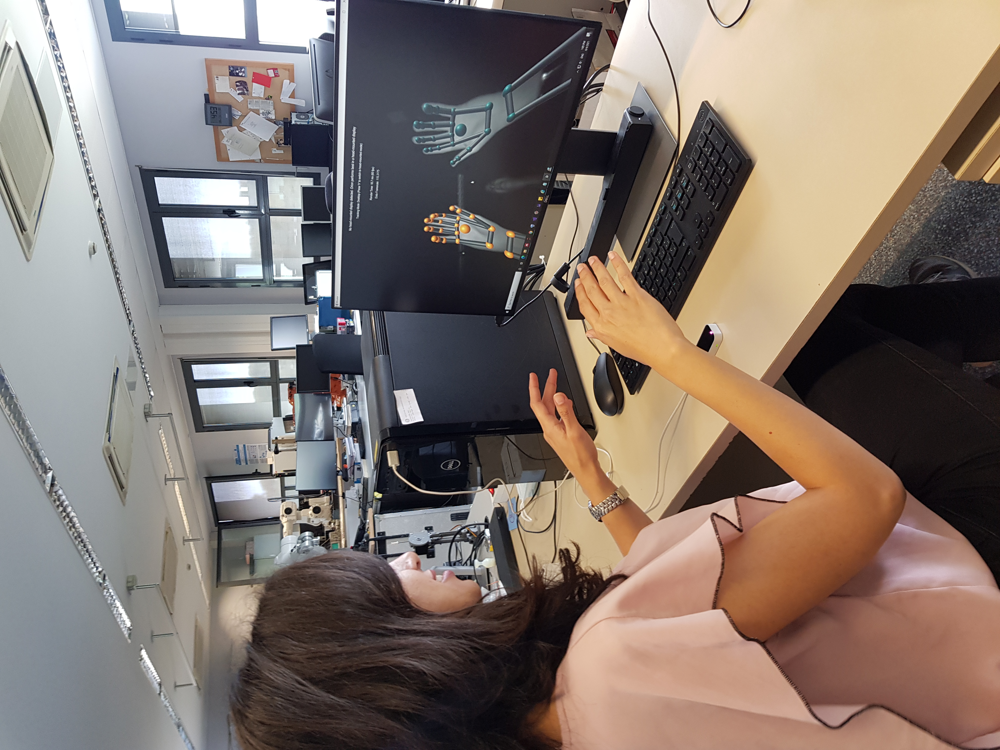

## Project Overview

This repository contains Python code for interfacing with a Leap Motion controller and extracting hand and finger kinematic features in real time. The extracted data can be used for applications such as rehabilitation, gesture analysis, and human–computer interaction research.

## System Demonstration

*Real-time hand tracking using a Leap Motion controller, showing detected hand joints and finger key points used for kinematic feature extraction.*

